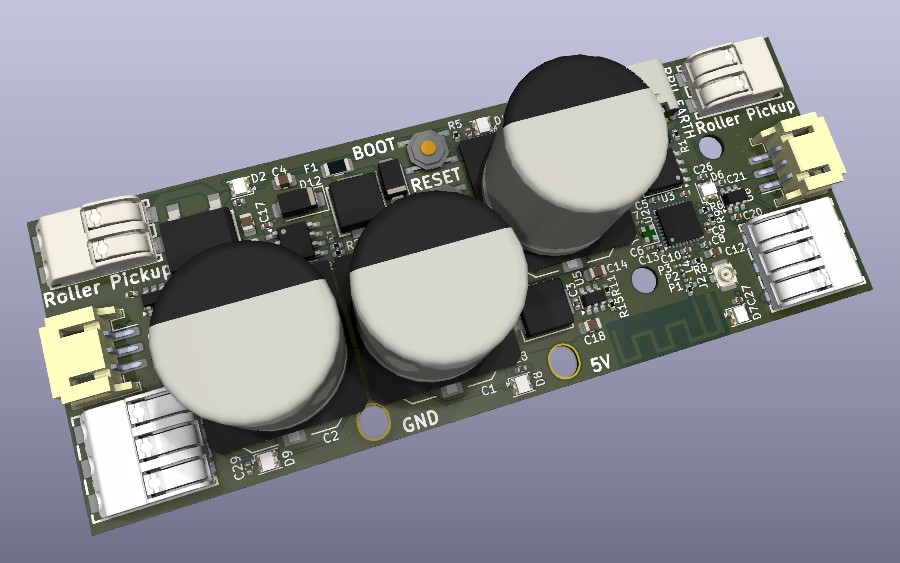

# Galvani AC LED Controller

A controller for driving pretty lights from AC-driven trains by connecting roller pickups.

Galvani is rated to drive 3 Amps. This is around 40 lights at full bright white, plus the wifi access point. Exceeding this value trips a resettable fuse.

Only run full LEDs when driving from a power supply. When running from USB, only use the onboard LEDs.

## Installation

Install WLED for the ESP32C3. Hold down the "PROG" button as plug in the USB cable. Alternately, hold down "PROG" and press "RESET".

Then, load the firmware using `esptool` or `probe-rs`.

## Testing the LEDs

You should be able to power a short string of LEDs from USB, depending on how much power your USB port can supply.

Use the built-in web interface on WLED. Connect to the access point labelled `WLED-AP`. The password is `wled1234`. Then go to the address `4.3.2.1` in your browser.

You can download an [iOS App](https://apps.apple.com/us/app/wled-native/id6446207239) or [Android App](https://play.google.com/store/apps/details?id=ca.cgagnier.wlednativeandroid) to control the lights from your phone or tablet.

## Connecting LED Strips

The onboard LEDs are connected to GPIO2. There are 8 onboard LEDs. The end of these LEDs go to the "Onboard" connector, allowing you to add more lights to this string.

There is also an "External" connector. This is connected to GPIO6 and has no onboard LEDs. You can use this connector to avoid having to skip the 8 onboard LEDs when driving a string.

## Connecting to the Roller Pickups

There are two roller pickup connectors. This is designed for setups where there are two pickups to ensure continuity when crossing track connections. You can operate with just one roller pickup, but that may affect the number of lights you can power, and there may be brownouts when crossing segments.

Connect the roller pickup to the connector marked "RPU". If you have two roller pickups, connect each of them to the two connectors.

Next, run a wire from the "EARTH" pin to the wheels. This will provide a return path.

There is no problem connecting both the roller pickups and USB at the same time -- there are a pair of diodes protecting each of the power sources.

**IMPORTANT**: Do not cross-connect RPU and EARTH! That is, do not connect RPU to the roller pickup on one side and RPU to the wheels on the other side! This will create a dead-short.
